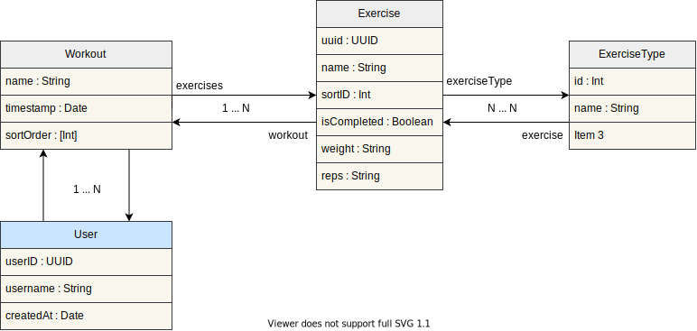

# Stronger

An iOS app featuring a clean and straightforward user interface, designed for simplicity and usability. It leverages native functionalities such as Core Data for local data persistence and CloudKit for data synchronization across devices. The primary goal is to provide users with an intuitive and unintrusive experience as they log and review their fitness progress during their workouts

### System Design

